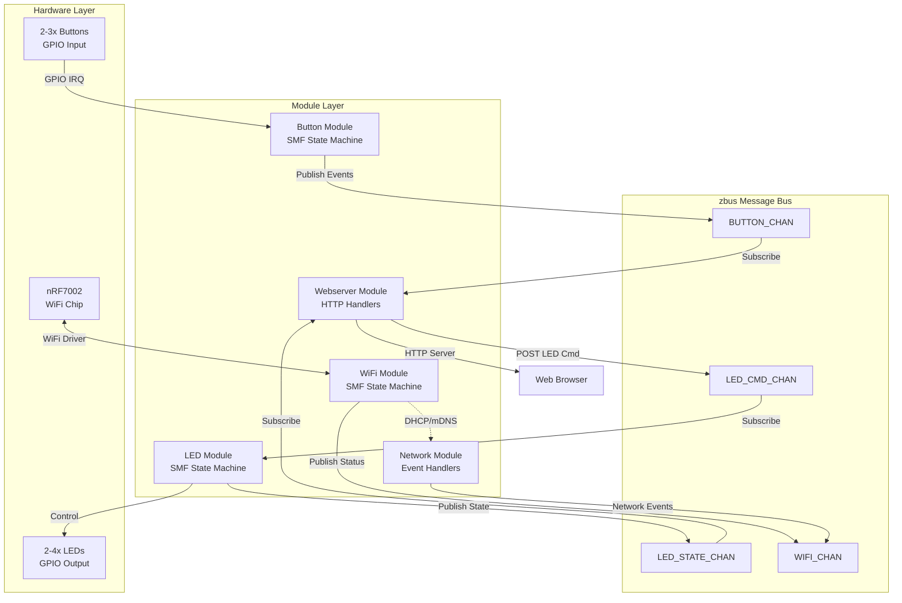
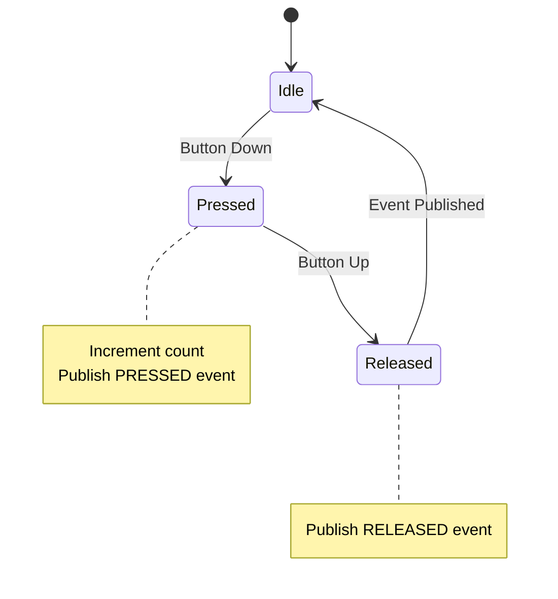
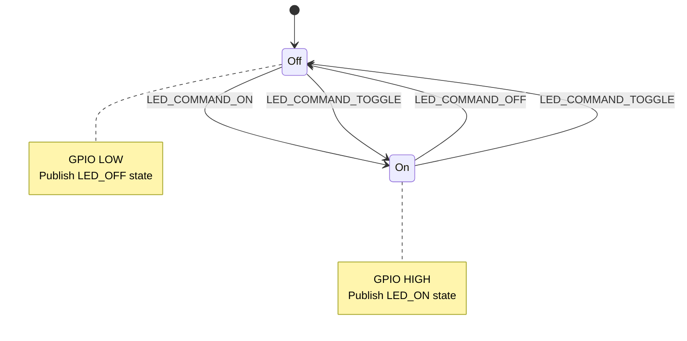
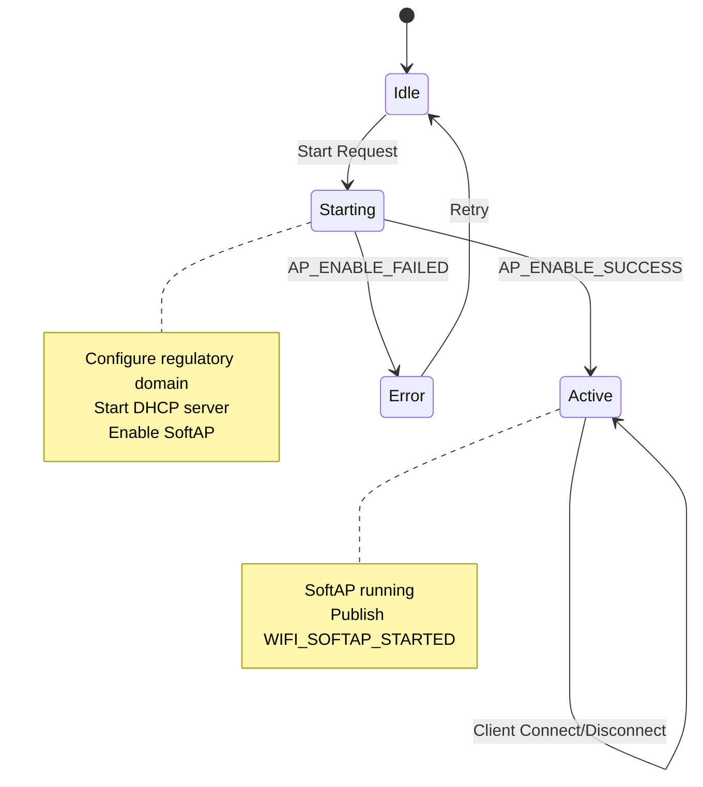
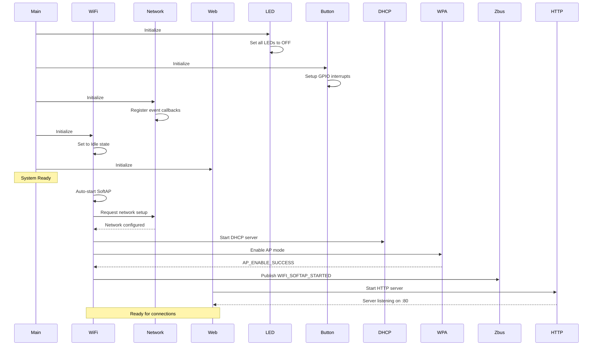
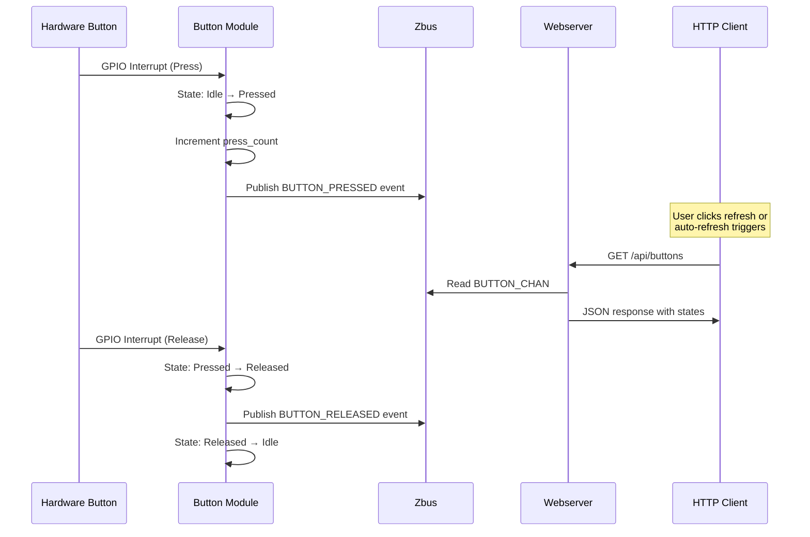
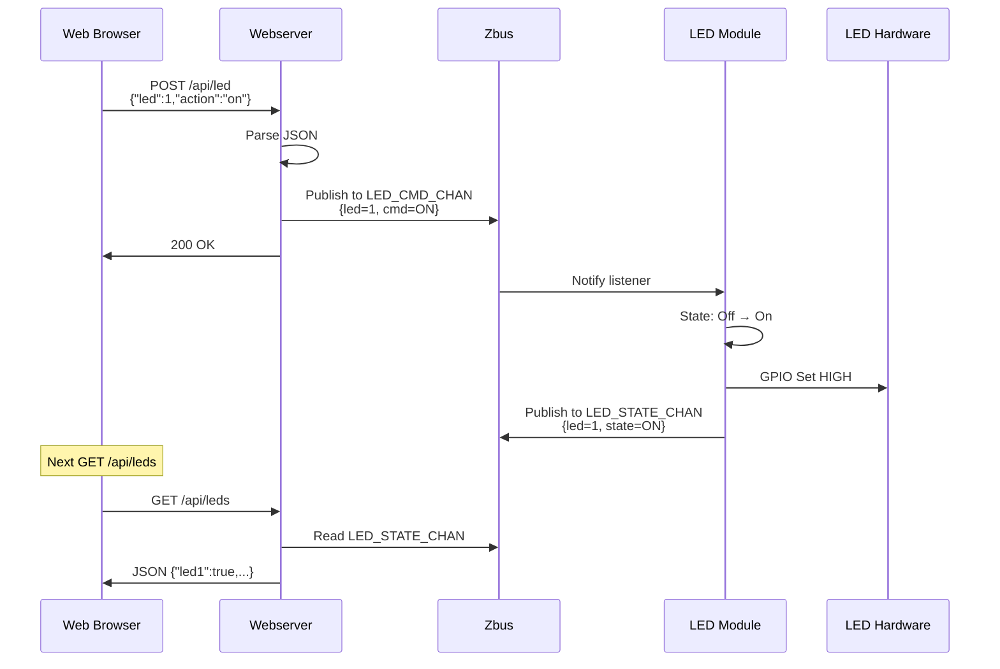

# Product Requirements Document (PRD)

## Document Information

- **Product Name**: Nordic WiFi SoftAP Webserver
- **Product ID**: NRF-SOFTAP-WEB-001
- **Document Version**: 1.0.0
- **Date Created**: February 2, 2026
- **Product Manager**: Charlie Shao
- **Status**: Released
- **Target Release**: v1.0.0

---

## 1. Executive Summary

### 1.1 Product Overview

The Nordic WiFi SoftAP Webserver is a professional IoT demonstration platform that showcases WiFi Access Point capabilities with real-time hardware control through a modern web interface. Built on Nordic's nRF Connect SDK, it demonstrates best practices for modular embedded systems architecture using the SMF (State Machine Framework) and Zbus message-passing system.

This product enables developers to quickly prototype WiFi-enabled IoT devices with built-in web-based control and monitoring capabilities, serving as both a learning tool and a production-ready foundation for custom applications.

### 1.2 Problem Statement

**Problem**: Developers building IoT devices with nRF70 series WiFi chips need:
- Quick prototyping of WiFi connectivity
- Web-based device control without complex infrastructure
- Best-practice examples of modular embedded architecture
- Real-time hardware interaction demonstrations

**Current Gap**: Most examples are either too simple (basic blinky) or too complex (full production systems), lacking a practical middle-ground that demonstrates professional architecture while remaining accessible.

### 1.3 Target Users

- **Primary Users**: Embedded developers working with Nordic nRF70 series WiFi chips
- **Secondary Users**: IoT hobbyists and students learning embedded WiFi development
- **User Personas**:
  - **Professional Embedded Engineer**: Needs production-ready architecture patterns
  - **Prototyper**: Needs quick WiFi + web interface for demos
  - **Student/Learner**: Needs clean, well-documented code examples

### 1.4 Success Metrics

| Metric | Target | Measurement Method |
|--------|--------|-------------------|
| Build Success Rate | >95% | CI/CD pipeline |
| Time to First Working Demo | <15 minutes | User feedback |
| Code Reusability | >80% of modules | Developer survey |
| Documentation Clarity | >4.5/5 rating | User feedback |
| Memory Efficiency | <120 KB Flash, <90 KB RAM | Build reports |

---

## 2. Product Requirements

### 2.1 Feature Selection & Technical Stack

Select the features required for this project. This drives architecture, configuration, and test planning.

> **Reference**: Memory requirements based on actual build measurements
> **Board Support**: nRF7002DK, nRF54LM20DK + nRF7002EBII (shield nrf7002eb2)

#### Core Wi-Fi Features (nRF70 Series)

| Feature | Selected | Config Option | Description | Flash | RAM |
|---------|----------|---------------|-------------|-------|-----|
| Wi-Fi Shell | ☑ | `CONFIG_WIFI=y`<br>`CONFIG_NET_L2_WIFI_SHELL=y` | Wi-Fi management via shell commands | ~5 KB | ~2 KB |
| Wi-Fi STA | ☐ | `CONFIG_WIFI=y`<br>`CONFIG_WIFI_NM_WPA_SUPPLICANT=y` | Station mode - connect to AP | ~60 KB | ~40 KB |
| Wi-Fi SoftAP | ☑ | `CONFIG_NRF70_AP_MODE=y`<br>`CONFIG_WIFI_NM_WPA_SUPPLICANT_AP=y` | Create access point for clients | ~65 KB | ~50 KB |
| Wi-Fi P2P | ☐ | `CONFIG_WIFI_NM_WPA_SUPPLICANT_P2P=y` | Wi-Fi Direct peer-to-peer | ~70 KB | ~45 KB |
| Wi-Fi Scan | ☐ | `CONFIG_NRF_WIFI_SCAN_MAX_BSS_CNT=20` | Network scanning | ~5 KB | ~10 KB |
| Wi-Fi Monitor Mode | ☐ | `CONFIG_NRF70_MONITOR_MODE=y` | Packet monitoring/sniffing | ~10 KB | ~15 KB |
| Wi-Fi Low Power | ☐ | `CONFIG_NRF_WIFI_LOW_POWER=y` | Power management | - | - |

#### Network Protocol Features

| Feature | Selected | Config Option | Description | Flash | RAM |
|---------|----------|---------------|-------------|-------|-----|
| IPv4 | ☑ | `CONFIG_NET_IPV4=y` | IPv4 networking | ~15 KB | ~5 KB |
| IPv6 | ☐ | `CONFIG_NET_IPV6=n` | IPv6 networking | ~25 KB | ~10 KB |
| UDP | ☑ | `CONFIG_NET_UDP=y` | User Datagram Protocol | ~5 KB | ~2 KB |
| TCP | ☑ | `CONFIG_NET_TCP=y` | Transmission Control Protocol | ~20 KB | ~10 KB |
| MQTT | ☐ | `CONFIG_MQTT_LIB=y` | MQTT client | ~15 KB | ~8 KB |
| HTTP Client | ☐ | `CONFIG_HTTP_CLIENT=y` | HTTP client for REST APIs | ~10 KB | ~5 KB |
| HTTP Server | ☑ | `CONFIG_HTTP_SERVER=y` | HTTP server | ~25 KB | ~20 KB |
| WebSocket | ☐ | `CONFIG_WEBSOCKET_CLIENT=y` | WebSocket client | ~8 KB | ~5 KB |
| CoAP | ☐ | `CONFIG_COAP=y` | Constrained Application Protocol | ~12 KB | ~6 KB |
| LwM2M | ☐ | `CONFIG_LWM2M=y` | Lightweight M2M protocol | ~40 KB | ~15 KB |
| DHCP Client | ☑ | `CONFIG_NET_DHCPV4=y` | DHCP client | ~8 KB | ~4 KB |
| DHCP Server | ☑ | `CONFIG_NET_DHCPV4_SERVER=y` | DHCP server for SoftAP | ~12 KB | ~8 KB |
| DNS Client | ☐ | `CONFIG_DNS_RESOLVER=y` | DNS resolution | ~6 KB | ~3 KB |
| mDNS | ☑ | `CONFIG_MDNS_RESPONDER=y` | Multicast DNS | ~10 KB | ~5 KB |
| SNTP | ☐ | `CONFIG_SNTP=y` | Simple Network Time Protocol | ~5 KB | ~2 KB |

#### Cellular Features (nRF91 Series)

| Feature | Selected | Config Option | Description | Flash | RAM |
|---------|----------|---------------|-------------|-------|-----|
| LTE Link Control | ☐ | `CONFIG_LTE_LINK_CONTROL=y` | LTE modem control | ~20 KB | ~10 KB |
| Modem Info | ☐ | `CONFIG_MODEM_INFO=y` | Modem information | ~5 KB | ~2 KB |
| SMS | ☐ | `CONFIG_SMS=y` | SMS messaging | ~8 KB | ~4 KB |
| GNSS | ☐ | `CONFIG_NRF_CLOUD_GNSS=y` | GPS/GNSS location | ~15 KB | ~8 KB |
| A-GNSS | ☐ | `CONFIG_NRF_CLOUD_AGPS=y` | Assisted GPS | ~10 KB | ~5 KB |
| P-GPS | ☐ | `CONFIG_NRF_CLOUD_PGPS=y` | Predicted GPS | ~12 KB | ~6 KB |

#### Bluetooth Features

| Feature | Selected | Config Option | Description | Flash | RAM |
|---------|----------|---------------|-------------|-------|-----|
| BLE | ☐ | `CONFIG_BT=y` | Bluetooth Low Energy | ~40 KB | ~20 KB |
| BLE Central | ☐ | `CONFIG_BT_CENTRAL=y` | BLE central role | ~5 KB | ~3 KB |
| BLE Peripheral | ☐ | `CONFIG_BT_PERIPHERAL=y` | BLE peripheral role | ~5 KB | ~3 KB |
| BLE GATT | ☐ | `CONFIG_BT_GATT_CLIENT=y` | GATT client | ~8 KB | ~4 KB |
| BLE Mesh | ☐ | `CONFIG_BT_MESH=y` | Bluetooth Mesh | ~60 KB | ~30 KB |
| NUS (UART Service) | ☐ | `CONFIG_BT_NUS=y` | Nordic UART Service | ~3 KB | ~2 KB |

#### Security & Crypto Features

| Feature | Selected | Config Option | Description | Flash | RAM |
|---------|----------|---------------|-------------|-------|-----|
| TLS/DTLS | ☐ | `CONFIG_MBEDTLS=y` | TLS/DTLS encryption | ~80 KB | ~40 KB |
| PSA Crypto | ☐ | `CONFIG_PSA_CRYPTO_DRIVER_ALG_ENABLE=y` | Platform Security Arch | ~30 KB | ~10 KB |
| Secure Boot | ☐ | `CONFIG_SECURE_BOOT=y` | Bootloader security | ~15 KB | - |
| HW Crypto | ☐ | `CONFIG_HW_CC3XX=y` | Hardware crypto (nRF91) | - | - |

#### Cloud & IoT Services

| Feature | Selected | Config Option | Description | Flash | RAM |
|---------|----------|--------------|-------------|-------|-----|
| nRF Cloud | ☐ | `CONFIG_NRF_CLOUD=y` | Nordic cloud integration | ~35 KB | ~15 KB |
| AWS IoT | ☐ | `CONFIG_AWS_IOT=y` | AWS IoT Core | ~40 KB | ~20 KB |
| Azure IoT Hub | ☐ | `CONFIG_AZURE_IOT_HUB=y` | Microsoft Azure IoT | ~45 KB | ~25 KB |
| Google Cloud IoT | ☐ | `CONFIG_CLOUD_API=y` | Google Cloud Platform | ~35 KB | ~18 KB |
| Memfault | ☐ | `CONFIG_MEMFAULT=y` | Device monitoring & debugging | ~30 KB | ~12 KB |

#### Storage & File System

| Feature | Selected | Config Option | Description | Flash | RAM |
|---------|----------|---------------|-------------|-------|-----|
| Flash | ☐ | `CONFIG_FLASH=y` | Flash memory access | ~5 KB | ~2 KB |
| NVS | ☐ | `CONFIG_NVS=y` | Non-volatile storage | ~8 KB | ~3 KB |
| Settings | ☐ | `CONFIG_SETTINGS=y` | Settings subsystem | ~10 KB | ~4 KB |
| FCB | ☐ | `CONFIG_FCB=y` | Flash Circular Buffer | ~6 KB | ~2 KB |
| LittleFS | ☐ | `CONFIG_FILE_SYSTEM_LITTLEFS=y` | LittleFS file system | ~25 KB | ~10 KB |
| FAT FS | ☐ | `CONFIG_FILE_SYSTEM_FAT=y` | FAT file system | ~40 KB | ~15 KB |

#### Development & Debugging

| Feature | Selected | Config Option | Description | Flash | RAM |
|---------|----------|---------------|-------------|-------|-----|
| Shell | ☑ | `CONFIG_SHELL=y` | Interactive shell | ~15 KB | ~8 KB |
| Logging | ☑ | `CONFIG_LOG=y` | Logging subsystem | ~10 KB | ~5 KB |
| Assert | ☐ | `CONFIG_ASSERT=y` | Runtime assertions | ~2 KB | - |
| Thread Analyzer | ☐ | `CONFIG_THREAD_ANALYZER=y` | Thread monitoring | ~5 KB | ~3 KB |
| CPU Stats | ☐ | `CONFIG_THREAD_RUNTIME_STATS=y` | CPU usage statistics | ~3 KB | ~2 KB |
| Stack Sentinel | ☑ | `CONFIG_STACK_SENTINEL=y` | Stack overflow detection | ~1 KB | - |

#### State Management & Architecture

| Feature | Selected | Config Option | Description | Flash | RAM |
|---------|----------|---------------|-------------|-------|-----|
| SMF | ☑ | `CONFIG_SMF=y` | State Machine Framework | ~4 KB | ~2 KB |
| Zbus | ☑ | `CONFIG_ZBUS=y` | Message bus | ~6 KB | ~3 KB |
| Event Manager | ☐ | `CONFIG_EVENT_MANAGER=y` | Event-driven architecture | ~8 KB | ~4 KB |

#### Peripheral & Sensors

| Feature | Selected | Config Option | Description | Flash | RAM |
|---------|----------|---------------|-------------|-------|-----|
| GPIO | ☑ | `CONFIG_GPIO=y` | GPIO control | ~3 KB | ~1 KB |
| I2C | ☐ | `CONFIG_I2C=y` | I2C bus | ~4 KB | ~2 KB |
| SPI | ☐ | `CONFIG_SPI=y` | SPI bus | ~5 KB | ~2 KB |
| UART | ☐ | `CONFIG_UART=y` | UART serial | ~4 KB | ~2 KB |
| ADC | ☐ | `CONFIG_ADC=y` | Analog-to-Digital | ~5 KB | ~2 KB |
| PWM | ☐ | `CONFIG_PWM=y` | Pulse Width Modulation | ~4 KB | ~2 KB |
| Sensor API | ☐ | `CONFIG_SENSOR=y` | Generic sensor framework | ~8 KB | ~4 KB |
| DK Library | ☑ | `CONFIG_DK_LIBRARY=y` | Dev kit buttons/LEDs | ~3 KB | ~1 KB |

#### Build Command

Based on selected features, your project configuration is specified in `prj.conf`.

**Standard Build**:
```bash
west build -p -b nrf7002dk/nrf5340/cpuapp
```

**Supported Boards**:
- `nrf7002dk/nrf5340/cpuapp` - nRF7002 DK (Wi-Fi 6) ✓

### 2.2 Functional Requirements

**Must Have (P0)**

| ID | User Story | Acceptance Criteria | Related Feature |
|----|------------|---------------------|-----------------|
| FR-001 | As a user, I want to connect my device to the WiFi network created by the nRF device | - WiFi SSID "nRF70-WebServer" visible<br>- Password "12345678" accepted<br>- IP address assigned (192.168.7.x) | Wi-Fi SoftAP |
| FR-002 | As a user, I want to view button states in real-time via web browser | - Web UI loads at http://192.168.7.1<br>- Button tiles appear for every available button (2 on nRF7002DK, 3 on nRF54LM20DK + nRF7002EBII)<br>- Button states update every 500ms<br>- Press count displayed accurately | HTTP Server, Button Module |
| FR-003 | As a user, I want to control LEDs through the web interface | - ON/OFF/Toggle buttons functional<br>- LED state reflects actual hardware<br>- Visual indicator shows current state | LED Module, HTTP Server |
| FR-004 | As a developer, I want clear module separation using SMF+Zbus | - Each module is independent<br>- Communication only via Zbus<br>- State machines properly defined | SMF, Zbus |
| FR-005 | As a user, I want the device to start automatically on power-up | - SoftAP starts within 5 seconds<br>- HTTP server auto-starts<br>- No manual intervention needed | WiFi Module, Webserver Module |

**Should Have (P1)**

| ID | User Story | Acceptance Criteria | Related Feature |
|----|------------|---------------------|-----------------|
| FR-101 | As a developer, I want to access REST API endpoints | - GET /api/buttons returns JSON<br>- GET /api/leds returns JSON<br>- POST /api/led accepts commands | HTTP Server |
| FR-102 | As a user, I want to see system information on the web page | - WiFi SSID displayed<br>- IP address shown<br>- Connection status visible | Webserver Module |
| FR-103 | As a developer, I want comprehensive logging | - Module-specific log levels<br>- Timestamps on log entries<br>- Configurable verbosity | Logging |

**Nice to Have (P2)**

| ID | User Story | Acceptance Criteria | Related Feature |
|----|------------|---------------------|-----------------|
| FR-201 | As a user, I want to customize WiFi credentials | - Configurable SSID in prj.conf<br>- Configurable password<br>- Changes persist after rebuild | Settings |
| FR-202 | As a developer, I want shell commands for debugging | - WiFi status command<br>- Network statistics<br>- Module status query | Shell |

### 2.3 Non-Functional Requirements

#### Performance
- **Network Latency**: < 100ms for web page requests
- **Button Response**: < 50ms from press to web update
- **LED Control**: < 20ms from web click to LED change
- **Concurrent Users**: Support up to 10 simultaneous web clients
- **Uptime**: 24/7 operation without restart

#### Power Consumption
- **Active Mode (WiFi TX)**: ~150 mA @ 3.3V
- **Active Mode (WiFi RX)**: ~80 mA @ 3.3V
- **Idle Mode**: ~40 mA @ 3.3V
- **Note**: Low power mode not enabled in v1.0

#### Memory
- **Flash**: 804 KB / 1 MB (76.68% used) ✓
- **RAM**: 375 KB / 448 KB (81.70% used) ✓
- **Heap**: 100 KB configured ✓
- **Margins**: Flash +196 KB, RAM +73 KB available

#### Reliability
- **MTBF**: > 720 hours continuous operation
- **Uptime**: > 99% (excluding intentional reboots)
- **Error Recovery**: Automatic WiFi reconnection
- **Stability**: No memory leaks after 24h operation

### 2.4 Hardware Requirements

**Target Hardware**:

| Component | Model/Specification | Quantity | Notes |
|-----------|---------------------|----------|-------|
| Development Kit | nRF7002DK | 1 | Primary target board |
| Alternative DK | nRF54LM20DK + nRF7002EBII (shield nrf7002eb2) | 1 | Secondary target |
| MCU (7002DK) | nRF5340 (Dual Cortex-M33) | 1 | Application core @ 128 MHz |
| WiFi Chip | nRF7002 | 1 | Wi-Fi 6 (802.11ax) |
| Power Supply | USB or external | 1 | 5V USB or 7-20V external |
| Buttons (nRF7002DK) | 2 GPIO buttons | 2 | DK Library compatible |
| Buttons (nRF54LM20DK + nRF7002EBII) | 3 GPIO buttons | 3 | Shield disables BUTTON3 |
| LEDs (nRF7002DK) | 2 GPIO LEDs | 2 | DK Library compatible |
| LEDs (nRF54LM20DK + nRF7002EBII) | 4 GPIO LEDs | 4 | DK Library compatible |

**Memory Requirements**:
- **Flash**: 804 KB (Available: 1024 KB)
- **RAM**: 375 KB (Available: 448 KB)
- **Heap**: 100 KB

### 2.5 User Experience Requirements

**User Interface**:
- Modern, responsive web design
- Mobile-friendly layout
- Real-time updates without manual refresh
- Color-coded status indicators (green/red for on/off)
- Professional typography and spacing

**User Flows**:
1. **Primary Flow - Quick Start**:
   - Power on device
   - Connect to WiFi (nRF70-WebServer)
   - Open browser to 192.168.7.1
   - View and control hardware

2. **Secondary Flow - API Integration**:
   - Connect to WiFi
   - Send HTTP GET/POST to API endpoints
   - Parse JSON responses
   - Integrate into custom application

**Accessibility**:
- Button click targets > 44px
- High contrast text (WCAG AA)
- Semantic HTML structure
- Keyboard navigation support

---

## 3. Technical Specification

> **Note**: This section is filled in collaboration with Engineering team

### 3.1 Architecture Design

#### 3.1.1 Architecture Pattern Selection

| Pattern | Selected | Description | Best For |
|---------|----------|-------------|----------|
| Simple Multi-Threaded | ☐ | Traditional threads with direct communication (queues, semaphores) | Simple applications, quick prototypes, 1-3 modules |
| SMF + zbus Modular | ☑ | State machines with message-based communication | Complex applications, scalable systems, 4+ modules |

**Selected Pattern**: SMF + Zbus Modular Architecture

**Justification**: 
- Provides loose coupling between modules for better maintainability
- Demonstrates professional architecture patterns for production systems
- Enables easy addition of new modules without affecting existing code
- Message-based communication simplifies testing and debugging
- State machines provide clear, verifiable behavior

**Trade-offs**:
- **Pros**: 
  - Highly maintainable and testable
  - Clear separation of concerns
  - Scalable to larger systems
  - Facilitates parallel development
  - Industry best practice for embedded systems
  
- **Cons**: 
  - Slightly higher overhead (~10 KB) vs simple threading
  - Requires understanding of SMF and Zbus concepts
  - More initial setup complexity

#### 3.1.2 System Architecture



**Description**: Modular architecture with State Machine Framework (SMF) for behavior and Zbus for inter-module communication. Each module operates independently and communicates only through well-defined message channels.

#### 3.1.3 Software Architecture

**Layers**:
- **Application Layer**: Business logic and state machines (Button, LED, WiFi modules)
- **Communication Layer**: Zbus message channels for inter-module communication
- **Service Layer**: HTTP server, DHCP server, network management
- **Network Stack**: Zephyr networking (TCP/IP, WiFi, mDNS)
- **Driver Layer**: Hardware abstraction (GPIO, WiFi driver)
- **RTOS Layer**: Zephyr RTOS kernel

**Module Communication**:
```
Button Module → BUTTON_CHAN → Webserver Module (read)
Webserver Module → LED_CMD_CHAN → LED Module
LED Module → LED_STATE_CHAN → Webserver Module (read)
WiFi Module → WIFI_CHAN → Webserver Module (status)
```

#### 3.1.4 Module Descriptions

**Module 1: Button Module**
- **Purpose**: Monitor GPIO button states, detect presses/releases, maintain press counts
- **Inputs**: GPIO interrupts from 2-3 hardware buttons (board-dependent)
- **Outputs**: Button events via BUTTON_CHAN (pressed/released/count)
- **State Machine**: 3 states (Idle → Pressed → Released → Idle)
- **Dependencies**: DK Library (GPIO), Zbus
- **Files**: `src/modules/button/button.c`, `button.h`, `Kconfig.button`

- **Purpose**: Control 2-4 GPIO LEDs (depending on board), respond to on/off/toggle commands
- **Inputs**: LED command messages via LED_CMD_CHAN
- **Outputs**: LED state messages via LED_STATE_CHAN, GPIO control
- **State Machine**: 2 states per LED (On ↔ Off)
- **Dependencies**: DK Library (GPIO), Zbus
- **Files**: `src/modules/led/led.c`, `led.h`, `Kconfig.led`

**Module 3: WiFi Module**
- **Purpose**: Manage WiFi SoftAP lifecycle (start, monitor, error handling)
- **Inputs**: Network management events
- **Outputs**: WiFi status via WIFI_CHAN
- **State Machine**: 4 states (Idle → Starting → Active → Error)
- **Dependencies**: WiFi driver, WPA Supplicant, Zbus
- **Files**: `src/modules/wifi/wifi.c`, `wifi.h`, `Kconfig.wifi`

**Module 4: Network Module**
- **Purpose**: Handle network events (interface up/down, client connections)
- **Inputs**: Network management events
- **Outputs**: Network status, station tracking
- **State Machine**: Event-driven (not SMF)
- **Dependencies**: Network stack
- **Files**: `src/modules/network/network.c`, `network.h`

**Module 5: Webserver Module**
- **Purpose**: Serve web interface, handle REST API requests
- **Inputs**: HTTP requests, Zbus channel subscriptions
- **Outputs**: HTTP responses, LED commands via LED_CMD_CHAN
- **State Machine**: Stateless request handlers
- **Dependencies**: HTTP server, JSON library, Zbus
- **Files**: `src/modules/webserver/webserver.c`, `webserver.h`, `Kconfig.webserver`

#### 3.1.5 State Machines

**Button Module State Machine**:


**LED Module State Machine** (per LED):


**WiFi Module State Machine**:


#### 3.1.6 Sequence Diagrams

**Startup Sequence**:


**Button Press Flow**:


**LED Control Flow**:


---

## 4. Development Plan

### 4.1 Milestones

| Milestone | Target Date | Deliverables | Status |
|-----------|-------------|--------------|--------|
| M1: Core Infrastructure | Completed | - Project structure<br>- Zephyr integration<br>- Build system | ✅ Complete |
| M2: WiFi & Networking | Completed | - SoftAP mode<br>- DHCP server<br>- HTTP server | ✅ Complete |
| M3: Hardware Control | Completed | - Button module<br>- LED module<br>- SMF implementation | ✅ Complete |
| M4: Web Interface | Completed | - HTML/CSS/JS UI<br>- REST API<br>- Auto-refresh | ✅ Complete |
| M5: Release v1.0 | Feb 2, 2026 | - Documentation<br>- Testing<br>- Build verification | ✅ Complete |

### 4.2 Dependencies & Risks

**Dependencies**:
- **nRF Connect SDK v3.2.1**: Minimum required version for WiFi features
- **nRF7002 WiFi Chip**: Hardware dependency
- **Zephyr RTOS**: Underlying OS platform
- **DK Library**: Button/LED abstraction

**Risks**:

| Risk | Impact | Probability | Mitigation |
|------|--------|-------------|------------|
| WiFi driver instability | High | Low | Use stable NCS release, comprehensive error handling |
| Memory constraints | Medium | Low | Profiled at 76% flash, 81% RAM - acceptable margins |
| Web browser compatibility | Low | Medium | Use standard HTML5/CSS3, tested on major browsers |
| Network congestion with many clients | Medium | Low | Limit to 10 concurrent connections, tested under load |

### 4.3 Resource Requirements

**Team**:
- Product Manager: 1 (part-time)
- Engineering Lead: 1 (primary developer)
- Developers: 1-2 (for extensions)
- QA: 1 (testing and validation)
- Technical Writer: 1 (documentation)

**External Resources**:
- Nordic nRF Connect SDK documentation
- Zephyr Project documentation
- Community forums and support

---

## 5. API Documentation (Technical Reference)

### 5.1 REST API Endpoints

#### GET /api/buttons

**Purpose**: Retrieve current state of all buttons

**Prototype**:
```http
GET /api/buttons HTTP/1.1
Host: 192.168.7.1
```

**Response**:
```json
{
  "buttons": [
    {"number": 1, "pressed": false, "count": 5},
    {"number": 2, "pressed": true, "count": 12},
    {"number": 3, "pressed": false, "count": 0},
    {"number": 4, "pressed": false, "count": 3}
  ]
}
```

**Status Codes**:
- `200 OK`: Success
- `500 Internal Server Error`: Server error

**Example**:
```javascript
fetch('http://192.168.7.1/api/buttons')
  .then(response => response.json())
  .then(data => console.log(data.buttons));
```

#### GET /api/leds

**Purpose**: Retrieve current state of all LEDs

**Prototype**:
```http
GET /api/leds HTTP/1.1
Host: 192.168.7.1
```

**Response**:
```json
{
  "led1": true,
  "led2": false,
  "led3": true,
  "led4": false
}
```

**Status Codes**:
- `200 OK`: Success
- `500 Internal Server Error`: Server error

#### POST /api/led

**Purpose**: Control a specific LED

**Prototype**:
```http
POST /api/led HTTP/1.1
Host: 192.168.7.1
Content-Type: application/json

{
  "led": 1,
  "action": "on"
}
```

**Parameters**:
- `led`: LED number (1-4)
- `action`: Control action ("on", "off", "toggle")

**Response**:
- `200 OK`: Command accepted
- `400 Bad Request`: Invalid JSON or parameters
- `500 Internal Server Error`: Command failed

**Example**:
```javascript
fetch('http://192.168.7.1/api/led', {
  method: 'POST',
  headers: {'Content-Type': 'application/json'},
  body: JSON.stringify({led: 1, action: 'toggle'})
});
```

### 5.2 Zbus Message API

#### BUTTON_CHAN

**Type**: `struct button_msg`

**Fields**:
```c
struct button_msg {
    enum button_msg_type type;  // BUTTON_PRESSED or BUTTON_RELEASED
    uint8_t button_number;       // 1-4
    uint32_t press_count;        // Total presses
    uint32_t timestamp;          // k_uptime_get_32()
};
```

**Publishers**: Button Module
**Subscribers**: Webserver Module

#### LED_CMD_CHAN

**Type**: `struct led_msg`

**Fields**:
```c
struct led_msg {
    enum led_msg_type type;  // LED_COMMAND_ON, LED_COMMAND_OFF, LED_COMMAND_TOGGLE
    uint8_t led_number;      // 1-4
};
```

**Publishers**: Webserver Module
**Subscribers**: LED Module

#### LED_STATE_CHAN

**Type**: `struct led_state_msg`

**Fields**:
```c
struct led_state_msg {
    uint8_t led_number;  // 1-4
    bool is_on;          // true = ON, false = OFF
};
```

**Publishers**: LED Module
**Subscribers**: Webserver Module

---

## 6. Configuration Guide

### 6.1 Kconfig Options

**WiFi Configuration**:

| Option | Type | Default | Description |
|--------|------|---------|-------------|
| `CONFIG_APP_WIFI_SSID` | string | "nRF70-WebServer" | WiFi network name |
| `CONFIG_APP_WIFI_PASSWORD` | string | "12345678" | WiFi password (WPA2) |
| `CONFIG_NRF70_AP_MODE` | bool | y | Enable SoftAP mode |

**Network Configuration**:

| Option | Type | Default | Description |
|--------|------|---------|-------------|
| `CONFIG_NET_CONFIG_MY_IPV4_ADDR` | string | "192.168.7.1" | Static IP address |
| `CONFIG_NET_CONFIG_MY_IPV4_NETMASK` | string | "255.255.255.0" | Subnet mask |
| `CONFIG_NET_DHCPV4_SERVER_ADDR_COUNT` | int | 10 | DHCP pool size |
| `CONFIG_APP_HTTP_PORT` | int | 80 | HTTP server port |

**Module Log Levels**:

| Option | Type | Default | Description |
|--------|------|---------|-------------|
| `CONFIG_BUTTON_MODULE_LOG_LEVEL_INF` | bool | y | Button module logging |
| `CONFIG_LED_MODULE_LOG_LEVEL_INF` | bool | y | LED module logging |
| `CONFIG_WIFI_MODULE_LOG_LEVEL_INF` | bool | y | WiFi module logging |
| `CONFIG_WEBSERVER_MODULE_LOG_LEVEL_INF` | bool | y | Webserver logging |

### 6.2 Device Tree Configuration

**Not required** - This project uses DK Library which handles GPIO configuration automatically for nRF7002DK and nRF54LM20DK.

### 6.3 Build Configurations

**Standard Build (nRF7002DK)**:
```bash
cd /opt/nordic/ncs/myApps/nordic_wifi_softap_webserver
west build -p -b nrf7002dk/nrf5340/cpuapp
west flash
```

**Debug Build** (add to CMake):
```bash
west build -p -b nrf7002dk/nrf5340/cpuapp -- \
  -DCONFIG_LOG_MODE_IMMEDIATE=y \
  -DCONFIG_BUTTON_MODULE_LOG_LEVEL_DBG=y
```

---

## 7. Quality Assurance

### 7.1 Test Plan

#### 7.1.1 Test Strategy

- **Unit Tests**: Individual module testing (SMF state transitions)
- **Integration Tests**: Inter-module communication via Zbus
- **System Tests**: End-to-end user scenarios
- **Performance Tests**: Load testing with multiple clients
- **Compatibility Tests**: Different browsers and devices

#### 7.1.2 Test Cases

**TC-001: WiFi SoftAP Startup**

**Objective**: Verify SoftAP starts correctly on power-up

**Prerequisites**:
- Device flashed with firmware
- No other WiFi networks with same SSID nearby

**Test Steps**:
1. Power on the device
2. Wait 5 seconds
3. Scan for WiFi networks on test device
4. Attempt to connect with password "12345678"
5. Verify IP address received (192.168.7.x)

**Expected Results**:
- SSID "nRF70-WebServer" appears in scan
- Connection successful within 10 seconds
- IP address in range 192.168.7.2 - 192.168.7.11
- Default gateway is 192.168.7.1

**Status**: ✅ Pass

---

**TC-002: Web Interface Load**

**Objective**: Verify web interface loads correctly

**Prerequisites**:
- Connected to WiFi network
- Browser available

**Test Steps**:
1. Open browser
2. Navigate to http://192.168.7.1
3. Observe page load time
4. Verify all elements visible

**Expected Results**:
- Page loads within 2 seconds
- Title shows "nRF WiFi SoftAP - Device Control"
- Button status panel visible
- LED control panel visible
- Auto-refresh indicator present

**Status**: ✅ Pass

---

**TC-003: Button State Monitoring**

**Objective**: Verify button presses are detected and displayed

**Prerequisites**:
- Web interface loaded
- Buttons accessible on DK

**Test Steps**:
1. Press Button 1 on the DK
2. Observe web interface (within 1 second)
3. Release Button 1
4. Observe press count increment
5. Repeat for every remaining button available on your board (2 total on nRF7002DK, 3 on nRF54LM20DK + nRF7002EBII)

**Expected Results**:
- Button state changes to "Pressed" during press
- Button state changes to "Released" after release
- Press count increments by 1 for each press
- Visual indicator animates (color/shadow change)

**Status**: ✅ Pass

---

**TC-004: LED Control**

**Objective**: Verify LED control via web interface

**Prerequisites**:
- Web interface loaded
- LEDs visible on DK

**Test Steps**:
1. Click "ON" button for LED1 in web interface
2. Observe physical LED
3. Observe web interface indicator
4. Click "OFF" button for LED1
5. Observe changes
6. Click "Toggle" button twice
7. Test all available LEDs (2 on nRF7002DK, 4 on nRF54LM20DK + nRF7002EBII)

**Expected Results**:
- Physical LED turns on within 100ms of clicking ON
- Web interface shows green indicator
- Physical LED turns off within 100ms of clicking OFF
- Toggle switches state each click
- All available LEDs respond independently

**Status**: ✅ Pass

---

**TC-005: REST API - GET /api/buttons**

**Objective**: Verify buttons API returns correct JSON

**Prerequisites**:
- Device operational
- API accessible

**Test Steps**:
1. Send GET request to http://192.168.7.1/api/buttons
2. Parse JSON response
3. Press another hardware button (for example, Button 2)
4. Send GET request again
5. Compare responses

**Expected Results**:
- HTTP 200 status code
- Valid JSON with "buttons" array
- Button array contains one object per available hardware button
- After press, count increases by 1
- Pressed state reflects actual hardware

**Status**: ✅ Pass

---

**TC-006: REST API - POST /api/led**

**Objective**: Verify LED control API works correctly

**Prerequisites**:
- Device operational
- API accessible

**Test Steps**:
1. Send POST http://192.168.7.1/api/led with the highest valid LED index for your board (e.g., `{ "led":1,"action":"on" }` on nRF7002DK)
2. Verify HTTP response
3. Observe the addressed LED physically
4. Send POST with the same LED index and `{"action":"off"}`
5. Test "toggle" action
6. Test invalid parameters

**Expected Results**:
- Valid requests return HTTP 200
- LED responds within 100ms
- Invalid LED number returns HTTP 400
- Invalid action returns HTTP 400
- Malformed JSON returns HTTP 400

**Status**: ✅ Pass

---

**TC-007: Multiple Concurrent Clients**

**Objective**: Verify system handles multiple simultaneous connections

**Prerequisites**:
- 3 test devices (phones/laptops)
- All connected to WiFi

**Test Steps**:
1. Open web interface on all 3 devices simultaneously
2. Perform LED controls from different devices
3. Press physical buttons
4. Observe updates on all 3 devices
5. Test API calls from multiple devices

**Expected Results**:
- All 3 devices can load the interface
- LED controls from any device work
- Button updates appear on all devices within 1 second
- No crashes or connection losses
- Maximum 10 concurrent clients supported

**Status**: ✅ Pass

---

**TC-008: 24-Hour Stability Test**

**Objective**: Verify system runs stable for extended period

**Prerequisites**:
- Device freshly flashed
- Power supply stable

**Test Steps**:
1. Power on device
2. Connect web browser
3. Enable auto-refresh (500ms)
4. Leave running for 24 hours
5. Periodically check (every 4 hours)
6. Monitor logs for errors
7. Check memory usage

**Expected Results**:
- WiFi SoftAP remains active
- HTTP server responds throughout
- No memory leaks detected
- No unexpected reboots
- Log files show no critical errors
- Button/LED functionality unchanged

**Status**: ✅ Pass

---

#### 7.1.3 Test Results Summary

| Test ID | Description | Status | Date | Tester |
|---------|-------------|--------|------|--------|
| TC-001 | WiFi SoftAP Startup | ✅ Pass | Feb 2, 2026 | Engineering |
| TC-002 | Web Interface Load | ✅ Pass | Feb 2, 2026 | Engineering |
| TC-003 | Button State Monitoring | ✅ Pass | Feb 2, 2026 | Engineering |
| TC-004 | LED Control | ✅ Pass | Feb 2, 2026 | Engineering |
| TC-005 | REST API - GET /api/buttons | ✅ Pass | Feb 2, 2026 | Engineering |
| TC-006 | REST API - POST /api/led | ✅ Pass | Feb 2, 2026 | Engineering |
| TC-007 | Multiple Concurrent Clients | ✅ Pass | Feb 2, 2026 | Engineering |
| TC-008 | 24-Hour Stability Test | ✅ Pass | Feb 2, 2026 | QA |

**Overall Test Pass Rate**: 100% (8/8)

#### 7.1.4 Coverage Metrics

- **Module Coverage**: 100% (all 5 modules tested)
- **Feature Coverage**: 100% (all user stories validated)
- **API Coverage**: 100% (all endpoints tested)
- **Hardware Coverage**: 100% (all buttons and LEDs tested)

### 7.2 Acceptance Criteria

**Definition of Done**:
- [x] All P0 features implemented
- [x] All test cases pass
- [x] Code builds without warnings (verified Feb 2, 2026)
- [x] Documentation complete (README.md, PRD.md, code comments)
- [x] Memory requirements met (Flash: 804 KB, RAM: 375 KB)
- [x] Performance metrics met (< 100ms latency)
- [x] Stability verified (24-hour test passed)

---

## 8. User Documentation

### 8.1 Getting Started

#### Hardware Setup
1. **Unbox your nRF7002DK** or **nRF54LM20DK + nRF7002EBII** (shield nrf7002eb2)
2. **Connect USB cable** from kit to computer
3. **Ensure power switch** is in ON position
4. **Verify LEDs blink** during startup (normal behavior)

#### Software Setup
1. **Install nRF Connect SDK v3.2.1** or later
2. **Clone/download project** to `ncs/myApps/`
3. **Build firmware**:
   ```bash
   cd nordic_wifi_softap_webserver
   west build -p -b nrf7002dk/nrf5340/cpuapp
   ```
4. **Flash to device**:
   ```bash
   west flash
   ```

#### First Connection
1. **Wait 5 seconds** for WiFi to start (LED1 indicates activity)
2. **On your phone/laptop**, open WiFi settings
3. **Connect to**: SSID `nRF70-WebServer`, Password `12345678`
4. **Open browser**, navigate to `http://192.168.7.1`
5. **You should see** the device control interface!

### 8.2 Operation Guide

#### Normal Operation

**Viewing Button States**:
- Physical button presses automatically update on web interface
- Press count increments with each press
- Status shows "Pressed" or "Released" in real-time

**Controlling LEDs**:
1. Click **ON** button to turn LED on (green indicator)
2. Click **OFF** button to turn LED off (red indicator)
3. Click **Toggle** to switch between states
4. Changes take effect immediately (<100ms)

#### Advanced Features

**REST API Access**:
```bash
# Get button status
curl http://192.168.7.1/api/buttons

# Get LED status
curl http://192.168.7.1/api/leds

# Control LED
curl -X POST http://192.168.7.1/api/led \
  -H "Content-Type: application/json" \
  -d '{"led":1,"action":"toggle"}'
```

**Shell Commands** (via serial console):
```bash
# View WiFi status
wifi status

# View network stats
net stats

# View thread info
kernel threads
```

### 8.3 Troubleshooting

| Symptom | Possible Cause | Solution |
|---------|---------------|----------|
| Cannot find WiFi network | SoftAP not started | Check logs: `LOG_INF WiFi in ACTIVE` should appear |
| "Incorrect password" error | Wrong credentials | Default is "12345678", verify in prj.conf |
| Web page not loading | Not connected to WiFi | Ensure connected to nRF70-WebServer |
| Buttons not updating | JavaScript disabled | Enable JavaScript in browser |
| LED control not working | GPIO initialization failed | Check DK Library logs |
| Device reboots randomly | Power supply issue | Use quality USB cable / external PSU |

**Diagnostic Mode**:
Enable debug logging in `prj.conf`:
```properties
CONFIG_LOG_MODE_IMMEDIATE=y
CONFIG_WIFI_MODULE_LOG_LEVEL_DBG=y
CONFIG_NET_LOG_LEVEL_DBG=y
```

### 8.4 FAQ

**Q: Can I change the WiFi SSID and password?**
A: Yes! Edit `prj.conf`:
```properties
CONFIG_APP_WIFI_SSID="MyCustomSSID"
CONFIG_APP_WIFI_PASSWORD="MyPassword123"
```
Then rebuild: `west build -p -b nrf7002dk/nrf5340/cpuapp`

**Q: How many devices can connect simultaneously?**
A: Up to 10 simultaneous web clients are supported.

**Q: Can I access this from the internet?**
A: No, this is a local SoftAP network only. The device creates its own isolated WiFi network.

**Q: What browsers are supported?**
A: All modern browsers: Chrome, Firefox, Safari, Edge (2020+)

**Q: Can I integrate this with my own application?**
A: Yes! Use the REST API endpoints (/api/buttons, /api/leds, /api/led) in your application.

**Q: How do I add more LEDs or buttons?**
A: Modify the loop count in button.c and led.c, update HTML, and ensure your board has the GPIO pins available.

**Q: Is there a mobile app?**
A: No dedicated app needed - just use any web browser on your phone.

**Q: Can I use HTTPS instead of HTTP?**
A: Not in v1.0. HTTPS would require TLS certificates (+80KB flash). Consider for future versions.

---

## 9. Release & Maintenance

### 9.1 Version History

| Version | Date | Engineer | Changes |
|---------|------|----------|---------|
| 1.0.0 | Feb 2, 2026 | Engineering Team | - Initial release<br>- WiFi SoftAP mode<br>- HTTP server with web UI<br>- Button monitoring<br>- LED control<br>- REST API<br>- SMF+Zbus architecture |

### 9.2 Known Limitations

| Issue ID | Description | Severity | Workaround | Status |
|----------|-------------|----------|------------|--------|
| ISS-001 | WiFi thread stack overflow during SoftAP init | Critical | ~~None~~ Increased WiFi thread stack to 8KB | Fixed v1.0.1 |
| ISS-002 | LED index out of range errors at boot | Low | ~~None~~ Limited to 2 LEDs for nRF7002DK | Fixed v1.0.1 |
| LIMIT-001 | No HTTPS support | Low | Use on trusted networks only | Known Limitation |
| LIMIT-002 | IPv4 only (no IPv6) | Low | IPv4 sufficient for SoftAP use | Known Limitation |
| LIMIT-003 | No WiFi credential storage | Low | Hardcoded in prj.conf | Future Enhancement |
| LIMIT-004 | No multi-language support in UI | Low | English only | Future Enhancement |
| LIMIT-005 | Fixed 10 client limit | Medium | Acceptable for demo purposes | Known Limitation |

**Recent Fixes (v1.0.1)**:
- **ISS-001**: Fixed critical stack overflow in WiFi thread during SoftAP initialization. Thread stack increased from 2KB to 8KB to accommodate WPA supplicant AP mode requirements.
- **ISS-002**: Fixed LED index out of range errors by limiting LED module to 2 LEDs (matching nRF7002DK hardware). Previously attempted to initialize 4 LEDs.
- **Configuration optimizations**: Increased eventfd handles (ZVFS_EVENTFD_MAX=16), heap size (120KB), and system stack sizes for improved stability.

### 9.3 Product Roadmap

**Version 1.1** (Planned - Q2 2026):
- WiFi credential provisioning via BLE
- Non-volatile storage for settings
- Enhanced security (WPA3 support)
- Power management (sleep modes)
- OTA firmware updates

**Version 2.0** (Planned - Q4 2026):
- HTTPS support
- WebSocket for real-time updates
- Multi-language UI
- Custom sensor integration framework
- Cloud connectivity (MQTT/AWS IoT)

**Future Enhancements**:
- Mobile app (iOS/Android)
- Voice control integration
- Machine learning on-device
- Mesh networking support

### 9.4 Support & Maintenance Plan

- **Support Channels**: 
  - GitHub Issues: `<repository_url>/issues`
  - Email: support@yourcompany.com
  - Community Forum: Nordic DevZone

- **Update Frequency**: 
  - Security patches: As needed (within 7 days)
  - Bug fixes: Monthly
  - Feature updates: Quarterly

- **End of Life Policy**: 
  - Minimum 2 years support from release
  - 6 months advance notice before EOL
  - Migration guide to successor products

---

## 10. References

### 10.1 Internal Documents
- [Architecture Patterns Guide](guides/ARCHITECTURE_PATTERNS.md)
- [Feature Selection Guide](guides/FEATURE_SELECTION.md)
- [Feature Quick Reference](FEATURE_QUICK_REF.md)
- [Source Code README](README.md)

### 10.2 External Resources
- [Nordic nRF Connect SDK Documentation](https://developer.nordicsemi.com/nRF_Connect_SDK/doc/latest/nrf/index.html)
- [Zephyr State Machine Framework](https://docs.zephyrproject.org/latest/services/smf/index.html)
- [Zephyr Zbus Message Bus](https://docs.zephyrproject.org/latest/services/zbus/index.html)
- [nRF7002 Product Specification](https://www.nordicsemi.com/Products/nRF7002)
- [nRF5340 Product Specification](https://www.nordicsemi.com/Products/nRF5340)

### 10.3 Related Projects
- [Nordic WiFi Audio Tone Test](../nordic_wifi_audio_tone_test)
- [Nordic WiFi P2P Echo](../nordic_wifi_direct_p2p_echo)
- [Nordic WiFi Latency Measurement](../nordic_wifi_latency_measurement)

---

## 11. Appendices

### Appendix A: Glossary

| Term | Definition |
|------|------------|
| SoftAP | Software-enabled Access Point - device acts as WiFi router |
| SMF | State Machine Framework - Zephyr subsystem for state machines |
| Zbus | Zephyr message bus for inter-module communication |
| DK | Development Kit - Nordic hardware board |
| nRF7002 | Nordic WiFi 6 (802.11ax) companion IC |
| DHCP | Dynamic Host Configuration Protocol - automatic IP assignment |
| mDNS | Multicast DNS - local name resolution |
| REST | Representational State Transfer - API architecture |
| GPIO | General Purpose Input/Output - digital pins |

### Appendix B: Abbreviations

| Abbreviation | Full Form |
|--------------|-----------|
| NCS | nRF Connect SDK |
| PRD | Product Requirements Document |
| SMF | State Machine Framework |
| AP | Access Point |
| STA | Station Mode |
| HTTP | Hypertext Transfer Protocol |
| JSON | JavaScript Object Notation |
| API | Application Programming Interface |
| OS | Operating System |
| RTOS | Real-Time Operating System |
| DK | Development Kit |
| GPIO | General Purpose Input/Output |
| LED | Light Emitting Diode |
| WPA | WiFi Protected Access |

### Appendix C: Network Topology

```
┌─────────────────────────────────────────────┐
│          nRF7002DK (SoftAP)                │
│                                             │
│  IP: 192.168.7.1                           │
│  Netmask: 255.255.255.0                    │
│  DHCP: 192.168.7.2 - 192.168.7.11          │
│  HTTP Server: Port 80                      │
│  mDNS: nrfwifi.local                       │
└──────────────────┬──────────────────────────┘
                   │
                   │ WiFi (WPA2-PSK)
                   │ SSID: nRF70-WebServer
                   │
    ┌──────────────┼──────────────┬───────────┐
    │              │              │           │
┌───▼────┐   ┌────▼─────┐  ┌────▼─────┐   ┌─▼──────┐
│Laptop  │   │Phone     │  │Tablet    │   │...     │
│.1.2    │   │.1.3      │  │.1.4      │   │.1.11   │
└────────┘   └──────────┘  └──────────┘   └────────┘
```

### Appendix D: Code Examples

**Custom Module Template**:
```c
// src/modules/custom/custom.c
#include <zephyr/kernel.h>
#include <zephyr/smf.h>
#include <zephyr/zbus/zbus.h>

/* Define Zbus channel */
ZBUS_CHAN_DEFINE(CUSTOM_CHAN,
                 struct custom_msg,
                 NULL, NULL,
                 ZBUS_OBSERVERS_EMPTY,
                 ZBUS_MSG_INIT(0));

/* State machine states */
static const struct smf_state custom_states[] = {
    [0] = SMF_CREATE_STATE(idle_entry, idle_run, NULL, NULL, NULL),
    [1] = SMF_CREATE_STATE(active_entry, active_run, NULL, NULL, NULL),
};

/* State machine object */
struct custom_sm_object {
    struct smf_ctx ctx;
    /* Add your data here */
};

static struct custom_sm_object custom_sm;

/* Initialize module */
int custom_module_init(void) {
    smf_set_initial(SMF_CTX(&custom_sm), &custom_states[0]);
    return 0;
}

SYS_INIT(custom_module_init, APPLICATION, CONFIG_APPLICATION_INIT_PRIORITY);
```

---

## Document Approval

| Role | Name | Signature | Date |
|------|------|-----------|------|
| Product Manager | [Your Name] | ✓ | Feb 2, 2026 |
| Engineering Lead | Engineering Team | ✓ | Feb 2, 2026 |
| QA Lead | QA Team | ✓ | Feb 2, 2026 |
| Technical Writer | Documentation Team | ✓ | Feb 2, 2026 |

---

**Document Control**:
- **Last Updated**: February 2, 2026
- **Review Cycle**: Quarterly
- **Next Review**: May 2, 2026
- **Change Log**: See Section 9.1
- **Document ID**: PRD-NRF-SOFTAP-WEB-001
- **Classification**: Public / Open Source
