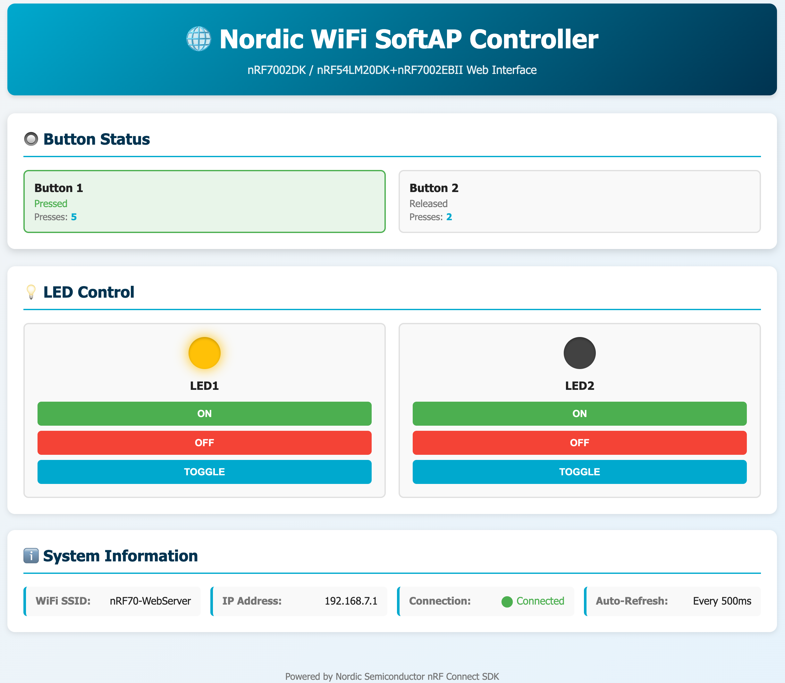

# Nordic WiFi SoftAP Webserver

[](https://github.com/chshzh/nordic-wifi-softap-webserver/actions/workflows/build.yml)
[](LICENSE)
[](https://www.nordicsemi.com/Products/Development-software/nRF-Connect-SDK)


A professional WiFi SoftAP web server application for **nRF7002DK** and **nRF54LM20DK+nRF7002EBII** development kits. Features a modular SMF+Zbus architecture for button monitoring and LED control via a web interface.

## 🎯 Features

- ✅ **WiFi SoftAP Mode** - Creates its own WiFi access point
- ✅ **Static Web Server** - Serves HTML/CSS/JavaScript interface
- ✅ **Button Monitoring** - Real-time button state and press count tracking
- ✅ **LED Control** - On/Off/Toggle control via web interface
- ✅ **SMF + Zbus Architecture** - Modular, maintainable, production-ready design
- ✅ **RESTful API** - JSON-based HTTP API for integration
- ✅ **Auto-Refresh** - Real-time updates every 500ms

## 📁 Project Structure

```
nordic_wifi_softap_webserver/
├── CMakeLists.txt           # Main build configuration
├── Kconfig                  # Kconfig menu
├── prj.conf                 # Project configuration
├── LICENSE                  # Nordic 5-Clause license
├── README.md                # This file
├── .gitignore              # Git ignore patterns
│
├── boards/                  # Board-specific configs
│   └── nrf7002dk_nrf5340_cpuapp.conf
│
├── src/
│   ├── main.c              # Application entry point
│   └── modules/
│       ├── messages.h      # Common message definitions
│       ├── button/         # Button module
│       │   ├── button.c
│       │   ├── button.h
│       │   ├── CMakeLists.txt
│       │   └── Kconfig.button
│       ├── led/            # LED module
│       │   ├── led.c
│       │   ├── led.h
│       │   ├── CMakeLists.txt
│       │   └── Kconfig.led
│       ├── wifi/           # WiFi SoftAP module
│       │   ├── wifi.c
│       │   ├── wifi.h
│       │   ├── CMakeLists.txt
│       │   └── Kconfig.wifi
│       └── webserver/      # HTTP server module
│           ├── webserver.c
│           ├── webserver.h
│           ├── CMakeLists.txt
│           └── Kconfig.webserver
│
└── www/                    # Web interface files
    ├── index.html
    ├── main.js
    └── styles.css
```

## 📋 Architecture

This project uses Nordic's recommended **SMF (State Machine Framework) + Zbus (Message Bus)** modular architecture:

```
┌─────────────┐     ┌─────────────┐     ┌─────────────┐
│   Button    │────▶│    Zbus     │◀────│     LED     │
│   Module    │     │  (Messages) │     │   Module    │
└─────────────┘     └─────────────┘     └─────────────┘
                           │
                    ┌──────┴──────┐
                    │             │
              ┌─────▼─────┐ ┌────▼─────┐
              │   WiFi    │ │Webserver │
              │  Module   │ │  Module  │
              └───────────┘ └──────────┘
```

### Module Breakdown

| Module | Purpose | State Machine |
|--------|---------|---------------|
| **Button** | GPIO button monitoring with debouncing | 3 states: Idle → Pressed → Released |
| **LED** | LED output control | 2 states: On ↔ Off |
| **WiFi** | SoftAP management | 4 states: Idle → Starting → Active → Error |
| **Webserver** | HTTP server and API endpoints | Stateless (request handlers) |

All inter-module communication uses **Zbus channels** for loose coupling.

## 🚀 Quick Start

### Prerequisites

- nRF Connect SDK v3.2.1 or later
- One of the supported hardware combinations:
  - nRF7002DK (nrf7002dk/nrf5340/cpuapp)
  - nRF54LM20DK + nRF7002EBII (nrf54lm20dk/nrf54lm20a/cpuapp + shield)
- Toolchain setup complete

### Build & Flash

#### For nRF7002DK

```bash
cd nordic_wifi_softap_webserver

west build -p -b nrf7002dk/nrf5340/cpuapp

west flash
```

#### For nRF54LM20DK + nRF7002EBII

```bash
cd nordic_wifi_softap_webserver

west build -p -b nrf54lm20dk/nrf54lm20a/cpuapp -- \
  -Dnordic_wifi_softap_webserver_SHIELD=nrf7002eb2 \
  -Dnordic_wifi_softap_webserver_SNIPPET=nrf70-wifi

west flash
```

> **⚠️ Hardware Limitation (nRF54LM20DK + nRF7002EBII):**
> When using the nRF7002EBII shield, **BUTTON3 is not available** due to pin conflicts with the shield's UART30 configuration (the shield overlay deletes `button_3`). Only **BUTTON0, BUTTON1, and BUTTON2** are functional on this hardware combination. All 4 LEDs remain available.

## 🧭 Workspace Application Setup

This repo is a **workspace application** as described in Nordic's guide ([Creating an application → Workspace application](https://docs.nordicsemi.com/bundle/ncs-latest/page/nrf/app_dev/create_application.html#workspace_application)). Everything you need is already declared in [`west.yml`](west.yml):

```yaml
manifest:
  version: 0.13
  defaults:
    remote: ncs
  remotes:
    - name: ncs
      url-base: https://github.com/nrfconnect
  projects:
    - name: nrf
      revision: v3.2.1
      import: true
  self:
    path: nordic_wifi_softap_webserver
```

**Quick start:**

1. Follow the Nordic docs section above for the detailed workflow (VS Code or CLI).
2. When the guide tells you to provide a manifest, point it to this project's `west.yml`.
3. Run `west update`, then build and flash as usual (`west build …`, `west flash`).

That's it—by referencing the official instructions you get a reproducible workspace tied to the NCS version pinned in the manifest.

### Connect

1. **Power on** the development kit
2. **Wait ~5 seconds** for WiFi SoftAP to start
3. **Connect your phone/laptop** to WiFi:
   - SSID: `nRF70-WebServer`
   - Password: `12345678`
  - (If you applied the credential overlay, use your custom SSID/password.)
4. **Open browser** to:
   - `http://192.168.7.1` (static IP)
   - `http://nrfwifi.local` (mDNS hostname - may not work on all devices)

## 📡 WiFi Configuration

Default settings (customizable in `prj.conf`):

```properties
CONFIG_APP_WIFI_SSID="nRF70-WebServer"
CONFIG_APP_WIFI_PASSWORD="12345678"
CONFIG_APP_HTTP_PORT=80
```

Static IP configuration:
- **Device IP**: 192.168.7.1
- **Netmask**: 255.255.255.0
- **Gateway**: 192.168.7.1
- **DHCP Server**: Enabled (192.168.7.2 - 192.168.7.11)
- **mDNS Hostname**: nrfwifi.local (enabled for easy discovery)

> **Note**: mDNS (`.local` hostname) may not work on all devices. Android devices often lack native mDNS support. Use the static IP `192.168.7.1` for guaranteed access.

### 🔒 Security Note

**⚠️ IMPORTANT**: The default WiFi password `"12345678"` is for **demonstration purposes only**.

**For production use:**
1. Copy the credential template and keep the real overlay out of version control:
  ```bash
  cp overlay-wifi-credentials.conf.template overlay-wifi-credentials.conf
  ```

2. Edit `overlay-wifi-credentials.conf` with your SSID/password (the filename is already listed in `.gitignore`).

3. Build with the credential overlay applied:
  ```bash
  west build -p -b nrf7002dk/nrf5340/cpuapp -- \
    -DEXTRA_CONF_FILE=overlay-wifi-credentials.conf
  ```

**Password Requirements:**
- Minimum 8 characters (WPA2-PSK requirement)
- Recommended: 12+ characters with mixed case, numbers, and symbols
- Never commit production credentials to version control
  (only `overlay-wifi-credentials.conf.template` is tracked by git)

## 🖥️ Web Interface



### Button Status Panel

Displays real-time status for all buttons (2 on nRF7002DK, 3 on nRF54LM20DK+nRF7002EBII):
- Current state (Pressed/Released)
- Total press count
- Visual indicator with animation

### LED Control Panel

Individual control for LEDs (2 on nRF7002DK, 4 on nRF54LM20DK+nRF7002EBII):
- **ON** - Turn LED on
- **OFF** - Turn LED off
- **Toggle** - Switch state
- Visual indicator shows current state

### System Information

- WiFi SSID
- IP Address
- Connection status
- Auto-refresh rate

## 🔌 REST API

All API endpoints support JSON.

### GET /api/buttons

Get current button states.

**Response:**
```json
{
  "buttons": [
    {"number": 0, "name": "Button 1", "pressed": false, "count": 5},
    {"number": 1, "name": "Button 2", "pressed": true, "count": 12}
  ]
}
```
Names adjust automatically based on the connected board (for example, nRF54LM20DK+nRF7002EBII adds a third entry for BUTTON2).

### GET /api/leds

Get current LED states.

**Response:**
```json
{
  "leds": [
    {"number": 0, "name": "LED1", "is_on": true},
    {"number": 1, "name": "LED2", "is_on": false}
  ]
}
```
Additional LED entries automatically appear on platforms with more GPIOs (e.g., four LED objects on nRF54LM20DK+nRF7002EBII).

### POST /api/led

Control an LED.

**Request:**
```json
{
  "led": 1,
  "action": "on"
}
```

**Actions:** `"on"`, `"off"`, `"toggle"`

## 🔧 Customization

### Change Default WiFi Credentials

Edit `prj.conf`:
```properties
CONFIG_APP_WIFI_SSID="YourSSID"
CONFIG_APP_WIFI_PASSWORD="YourPassword"
```

### Change HTTP Port

Edit `prj.conf`:
```properties
CONFIG_APP_HTTP_PORT=8080
```

### Adjust Refresh Rate

Edit `www/main.js`:
```javascript
const REFRESH_INTERVAL = 1000; // Change to 1 second
```

### Modify Hostname

Edit `prj.conf`:
```properties
CONFIG_NET_HOSTNAME="nrfwifi"
```

Then access via `http://nrfwifi.local` (default) or your custom hostname.

## 📊 Memory Usage

Approximate memory footprint:

| Component | Flash | RAM |
|-----------|-------|-----|
| WiFi Stack | ~60 KB | ~50 KB |
| HTTP Server | ~25 KB | ~20 KB |
| SMF/Zbus | ~10 KB | ~5 KB |
| Application | ~15 KB | ~10 KB |
| **Total** | **~110 KB** | **~85 KB** |

Heap requirement: **100 KB minimum** (configured in `prj.conf`)

## 🐛 Troubleshooting

### WiFi SoftAP not starting

1. Check logs: `west build -t menuconfig` → Enable detailed WiFi logging
2. Verify board has nRF70 series WiFi chip
3. Ensure firmware is flashed correctly

### Cannot connect to WiFi

1. Verify SSID and password in configuration
2. Check that WiFi is in SoftAP mode (not station mode)
3. Try forgetting and reconnecting to the network

### Web interface not loading

1. Verify IP address is 192.168.7.1
2. Check HTTP server is running (check logs)
3. Ensure firewall is not blocking connection
4. Try different browser

### Buttons not responding

1. Check GPIO configuration for your board
2. Verify DK library is enabled
3. Check button wiring (if using custom board)

### LED control not working

1. Verify LEDs are properly configured in device tree
2. Check DK library initialization
3. Verify LED Zbus channel is working

## 📝 Development Notes

### Adding New Modules

1. Create new directory under `src/modules/`
2. Add SMF states and Zbus channels
3. Define module in `CMakeLists.txt`
4. Add Kconfig options
5. Update `messages.h` with new message types

### Debugging

Enable detailed logging in `prj.conf`:
```properties
CONFIG_LOG_MODE_IMMEDIATE=y
CONFIG_BUTTON_MODULE_LOG_LEVEL_DBG=y
CONFIG_LED_MODULE_LOG_LEVEL_DBG=y
CONFIG_WIFI_MODULE_LOG_LEVEL_DBG=y
CONFIG_WEBSERVER_MODULE_LOG_LEVEL_DBG=y
```

### Thread Stack Analysis

Enable thread analyzer in `prj.conf`:
```properties
CONFIG_THREAD_ANALYZER=y
CONFIG_THREAD_ANALYZER_USE_LOG=y
CONFIG_THREAD_ANALYZER_AUTO=y
CONFIG_THREAD_ANALYZER_AUTO_INTERVAL=5
```

## 📚 References

- [nRF Connect SDK Documentation](https://developer.nordicsemi.com/nRF_Connect_SDK/doc/latest/nrf/index.html)
- [Zephyr State Machine Framework](https://docs.zephyrproject.org/latest/services/smf/index.html)
- [Zephyr Zbus](https://docs.zephyrproject.org/latest/services/zbus/index.html)
- [nRF70 Series WiFi](https://www.nordicsemi.com/Products/nRF7002)

## 🤝 Contributing

This project follows Nordic Semiconductor coding standards. Contributions welcome!

## 📄 License

Copyright (c) 2026 Nordic Semiconductor ASA

SPDX-License-Identifier: LicenseRef-Nordic-5-Clause

## �️ Development

This project was developed using [Claude Skills](https://github.com/chshzh/claude-skills) with Product Manager and Developer roles for systematic requirements management, architecture design, and implementation.

---

**Happy coding!** 🚀
